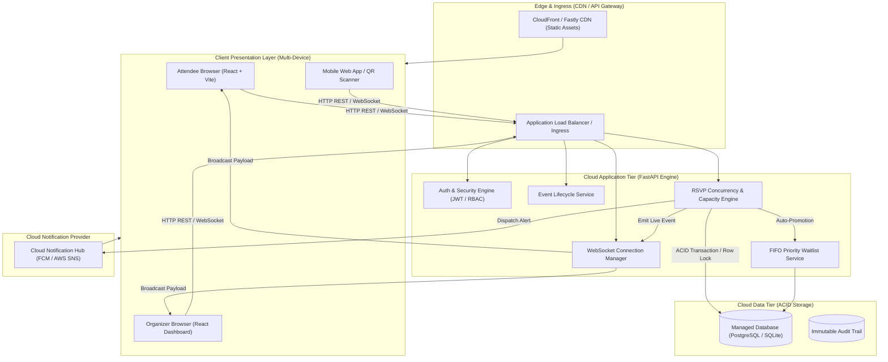
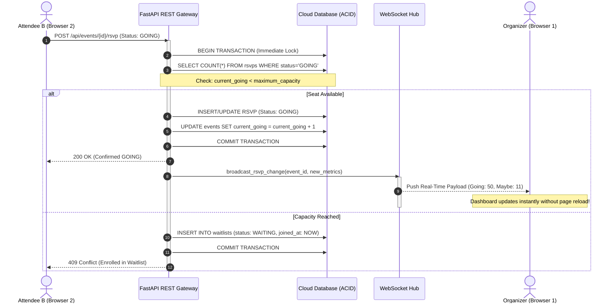
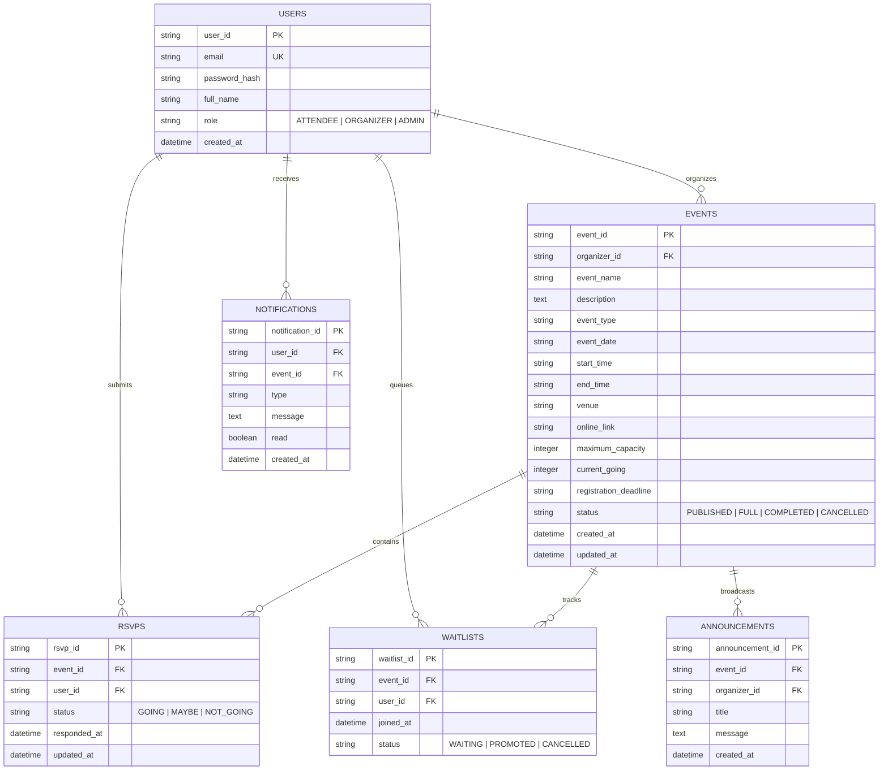

# System Architecture & Cloud Engineering Design

## 1. Cloud Architecture Overview

```mermaid
flowchart TD
    subgraph ClientLayer ["Client Presentation Layer (Multi-Device)"]
        Browser1["Attendee Browser (React + Vite)"]
        Browser2["Organizer Browser (React Dashboard)"]
        Mobile["Mobile Web App / QR Scanner"]
    end

    subgraph GatewayLayer ["Edge & Ingress (CDN / API Gateway)"]
        CDN["CloudFront / Fastly CDN (Static Assets)"]
        LB["Application Load Balancer / Ingress"]
    end

    subgraph ServiceLayer ["Cloud Application Tier (FastAPI Engine)"]
        AuthSvc["Auth & Security Engine (JWT / RBAC)"]
        EventSvc["Event Lifecycle Service"]
        RsvpSvc["RSVP Concurrency & Capacity Engine"]
        WaitlistSvc["FIFO Priority Waitlist Service"]
        PubSubMgr["WebSocket Connection Manager"]
    end

    subgraph StorageLayer ["Cloud Data Tier (ACID Storage)"]
        CloudDB[("Managed Database (PostgreSQL / SQLite)")]
        AuditStore[("Immutable Audit Trail")]
    end

    subgraph MessagingLayer ["Cloud Notification Provider"]
        NotifSvc["Cloud Notification Hub (FCM / AWS SNS)"]
    end

    Browser1 -->|HTTP REST / WebSocket| LB
    Browser2 -->|HTTP REST / WebSocket| LB
    Mobile -->|HTTP REST / WebSocket| LB
    CDN --> ClientLayer

    LB --> AuthSvc
    LB --> EventSvc
    LB --> RsvpSvc
    LB --> PubSubMgr

    RsvpSvc -->|ACID Transaction / Row Lock| CloudDB
    RsvpSvc -->|Auto-Promotion| WaitlistSvc
    RsvpSvc -->|Emit Live Event| PubSubMgr
    RsvpSvc -->|Dispatch Alert| NotifSvc

    WaitlistSvc --> CloudDB
    PubSubMgr -->|Broadcast Payload| Browser2
    PubSubMgr -->|Broadcast Payload| Browser1
    NotifSvc --> ClientLayer
```

---

## 2. Real-Time RSVP Event Pipeline

```mermaid
sequenceDiagram
    autonumber
    actor Attendee as Attendee B (Browser 2)
    participant API as FastAPI REST Gateway
    participant DB as Cloud Database (ACID)
    participant WS as WebSocket Hub
    actor Organizer as Organizer (Browser 1)

    Attendee->>API: POST /api/events/{id}/rsvp (Status: GOING)
    activate API
    API->>DB: BEGIN TRANSACTION (Immediate Lock)
    API->>DB: SELECT COUNT(*) FROM rsvps WHERE status='GOING'
    Note over API,DB: Check: current_going < maximum_capacity
    alt Seat Available
        API->>DB: INSERT/UPDATE RSVP (Status: GOING)
        API->>DB: UPDATE events SET current_going = current_going + 1
        API->>DB: COMMIT TRANSACTION
        API-->>Attendee: 200 OK (Confirmed GOING)
        API->>WS: broadcast_rsvp_change(event_id, new_metrics)
        activate WS
        WS-->>Organizer: Push Real-Time Payload (Going: 50, Maybe: 11)
        Note over Organizer: Dashboard updates instantly without page reload!
        deactivate WS
    else Capacity Reached
        API->>DB: INSERT INTO waitlists (status: WAITING, joined_at: NOW)
        API->>DB: COMMIT TRANSACTION
        API-->>Attendee: 409 Conflict (Enrolled in Waitlist)
    end
    deactivate API
```

---

## 3. Entity-Relationship (ER) Data Model

```mermaid
erDiagram
    USERS ||--o{ EVENTS : organizes
    USERS ||--o{ RSVPS : submits
    USERS ||--o{ WAITLISTS : queues
    USERS ||--o{ NOTIFICATIONS : receives
    EVENTS ||--o{ RSVPS : contains
    EVENTS ||--o{ WAITLISTS : tracks
    EVENTS ||--o{ ANNOUNCEMENTS : broadcasts

    USERS {
        string user_id PK
        string email UK
        string password_hash
        string full_name
        string role "ATTENDEE | ORGANIZER | ADMIN"
        datetime created_at
    }

    EVENTS {
        string event_id PK
        string organizer_id FK
        string event_name
        text description
        string event_type
        string event_date
        string start_time
        string end_time
        string venue
        string online_link
        integer maximum_capacity
        integer current_going
        string registration_deadline
        string status "PUBLISHED | FULL | COMPLETED | CANCELLED"
        datetime created_at
        datetime updated_at
    }

    RSVPS {
        string rsvp_id PK
        string event_id FK
        string user_id FK
        string status "GOING | MAYBE | NOT_GOING"
        datetime responded_at
        datetime updated_at
    }

    WAITLISTS {
        string waitlist_id PK
        string event_id FK
        string user_id FK
        datetime joined_at
        string status "WAITING | PROMOTED | CANCELLED"
    }

    ANNOUNCEMENTS {
        string announcement_id PK
        string event_id FK
        string organizer_id FK
        string title
        text message
        datetime created_at
    }

    NOTIFICATIONS {
        string notification_id PK
        string user_id FK
        string event_id FK
        string type
        text message
        boolean read
        datetime created_at
    }
```
